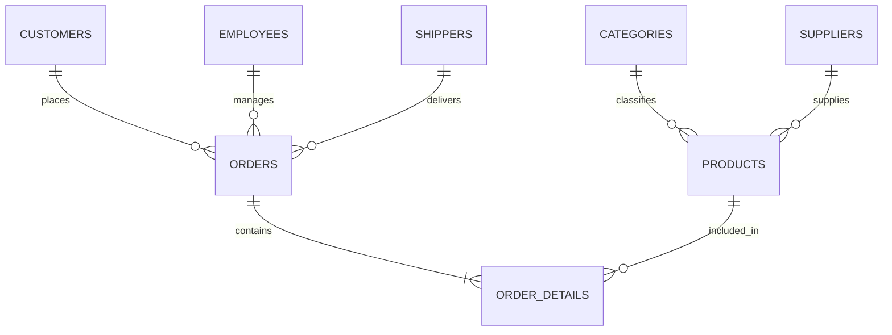

# 📊 Frostline Sales Analytics & Executive Dashboard


> An end-to-end commercial sales performance dashboard built in Microsoft Excel, featuring relational multi-table modeling, automated KPI cards, and dynamic slicers for regional and temporal sales tracking.

---

## 📌 Project Overview

**Frostline** is a simulated B2B/B2C retail enterprise handling multi-category orders across global regions. This project translates raw transactional records into an interactive executive dashboard designed for sales managers and operational leads.

### Business Goals:
- Monitor core revenue indicators: Total Sales, Order Volume, Average Order Value (AOV), and Discount Impact.
- Identify top-performing product categories, high-value corporate clients, and leading sales representatives.
- Enable ad-hoc cross-filtering by date, region, product category, and shipping provider using interactive slicers.

---

## 🗂️ Data Architecture & Data Model

The analysis is structured across a relational schema with multiple normalized dimensions:



- **Fact Tables:**
  - `orders`: Order ID, Customer ID, Employee ID, Order Date, Shipping details.
  - `ordersdetails`: Unit Price, Quantity, Discount %, Total Line Revenue.
- **Dimension Tables:**
  - `customers`: Customer Name, Contact, Country, Region.
  - `products`: Product Name, Category ID, Supplier ID, Unit Price, Units in Stock.
  - `categories`: Category Name, Description.
  - `employees`: Sales Rep names and territory assignments.
  - `shippers` & `suppliers`: Partner logistics and supply details.

---

## 📈 Dashboard Features & KPIs

1. **Executive KPI Header:**
   - Real-time aggregation of Total Revenue, Total Units Sold, Average Margin, and Active Customers.
2. **Category & Product Performance:**
   - Breakdown of sales volume by product category to pinpoint inventory winners.
3. **Customer & Geographic Breakdown:**
   - Identification of top-tier accounts driving 80% of revenue (Pareto Principle).
4. **Logistics & Shipper Efficiency:**
   - Analysis of shipment durations and delivery partner performance.
5. **Dynamic Slicers:**
   - Interactive UI filters allowing one-click drill-downs by Year/Quarter, Category, and Country.

---

## 💡 Key Business Recommendations

- **Focus on High-Margin Categories:** Rebalance marketing spend towards top-performing product lines that show steady repeat purchase rates.
- **Customer Retention Programs:** Target the top 10 enterprise accounts with customized loyalty tiers to protect recurring revenue.
- **Logistics Optimization:** Review delivery variance among shippers to reduce transit lead times for delayed freight routes.

---

## 📁 Repository Structure

```
├── orders_frostonline.xlsx      # Master workbook with data model, calculations & interactive dashboard
└── README.md                    # Project documentation & business summary
```

---

## 👤 Author
**Mohamed Hamdy**
- GitHub: [@mo010686](https://github.com/mo010686)
- LinkedIn: [Mohamed Hamdy](https://linkedin.com/in/YOUR-LINKEDIN-USERNAME)
